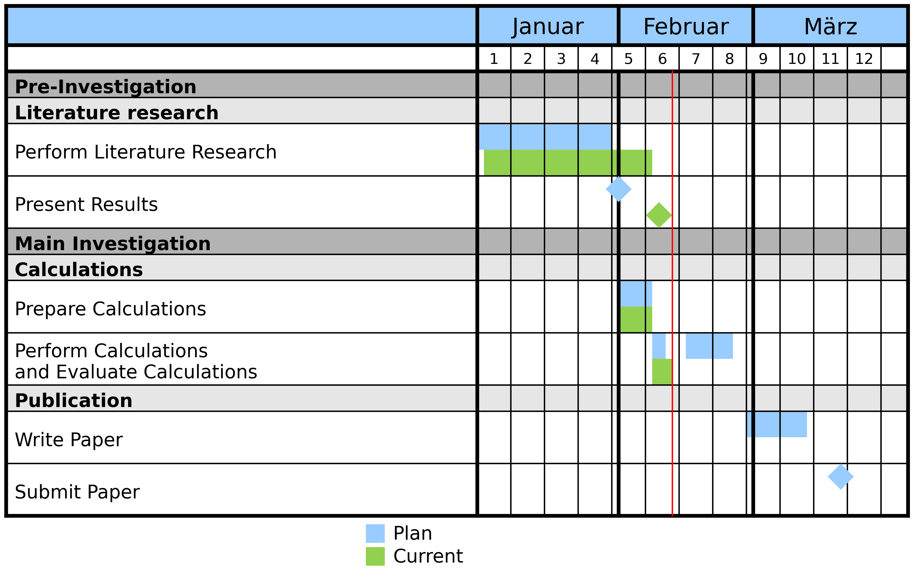

.. _tutorial:

Tutorial
########

In this chapter, several tutrials can be found which show the usage of
``pymilestone``. The milestone can be customized with different properties,
see :class:`~pymilestone.milestoneplan.Milestoneplan` for more details.

Basic Usage
===========

In this tutorial, the basic usage of ``pymilestone`` is shown. For this,
a simple milestoneplan is created.

Pre-Configuration
-----------------

First, the required modules must be imported:

.. code-block:: python

    from datetime import datetime
    from pymilestone import Milestoneplan, Task, Milestone, Caption, Subcaption, Category
    
In the next step, a variable ``date_today`` is defined with the current date.
This allows for ongoing task to be automatically updated. In this tutorial,
``date_today`` is set to a fixed date (so that the image will be the same, when
you run the tutorial):

.. code-block:: python

    date_today = datetime(2022, 2, 10)
    
You can use ``datetime.now()``, so set this variable to the current date.

In the next step, a ``Milestoneplan`` object is created. The constructor defines
its appereance.

.. code-block:: python

    my_milestone = Milestoneplan(
        include_weekend=False, today=date_today,
        key_top_caption="month", key_sub_caption="week"
    )

For now, we will ignore the parameters. For more details see
:class:`~pymilestone.Milestoneplan.Milestoneplan` and
the tutorial :ref:`tutorial_customization` below.

Add Categories
--------------

In the next step, the categories must be added. Categories must be configured
by the user. For example, one might use one category for the plan and another
category for the current state of the work:

.. code-block:: python

    my_milestone.add_category(
        Category(key="plan", displayname="Plan",
                 color=(153/255, 204/255, 255/255))
    )
        
    my_milestone.add_category(
        Category(key="actual", displayname="Current",
                 color=(146/255, 208/255, 80/255))
    )

Each category will be shown in a separate line with the predefined color.
The value for ``key`` can be chosen arbitrarily, but must be unique.
The displayname can also be chosen arbitrarily, it will be shown in the
legend. The color for each category must also be set by the user.

Add Tasks
---------

Now, the milestoneplan is configured and tasks can be added. The following
elements can now be added to the milestoneplan:

    - Caption: Caption of a group of tasks.
    - Subcaption: Caption for a sub-group of tasks.
    - Task: Task, which has a date range, in which it is performed.
    - Milestone: Milestone, which has a date, at which it should be finished.
    
All elements can be added with the method ``add_element``.

Adding Captions and Subcaption is simple, as they require only a description
(key ``text``):

.. code-block:: python

    my_milestone.add_element(Caption(text="Pre-Investigation"))
    my_milestone.add_element(Subcaption(text="Literature research"))

Tasks can also be added easily, but they require additional details of the
time range, in which they should be / are performed. For this, the
``add_date_range`` of the ``Task`` object can be used. Since it returns
itself, the ``add_date_range`` calls can be chained:

.. code-block:: python

    my_milestone.add_element(
        Task(text="Perform Literature Research")
            .add_date_range(key="plan",
                            start_date=datetime(2022, 1, 1),
                            end_date=datetime(2022, 1, 30))
            .add_date_range(key="actual",
                            start_date=datetime(2022, 1, 4),
                            end_date=datetime(2022, 2, 7))
    )
    
So first, the task was created. Then, the details for the cateogry
``plan`` are added. And finally, the details for the category
``actual`` are added.

A milestone can be added in a similar way. Since it is due to one specific
date, the ``add_date`` method must be used:

.. code-block:: python

    my_milestone.add_element(
        Milestone(text="Present Results")
            .add_date(key="plan",
                      date=datetime(2022, 1, 31))
            .add_date(key="actual",
                      date=datetime(2022, 2, 8))
    )

Render Milestoneplan
--------------------

Until now, only the details were added. Now, the milestoneplan must be
plotted. Usually, it will also be saved into a file:

.. code-block:: python

    fig = my_milestone.create_fig()
    
    f_path_out = r"N:\my_milestoneplan.png"
    fig.savefig(f_path_out, dpi=600)

Resulting Milestoneplan
-----------------------

The following code block summarises the above tutorial:

.. code-block:: python

    import os
    from datetime import datetime
    
    from pymilestone import Milestoneplan, Task, Milestone, Caption, Subcaption, Category
    
    date_today = datetime(2022, 2, 10)
    
    my_milestone = Milestoneplan(
        include_weekend=False, today=date_today,
        key_top_caption="month", key_sub_caption="week"
    )
    
    my_milestone.add_category(
        Category(key="plan", displayname="Plan",
                 color=(153/255, 204/255, 255/255))
    )
        
    my_milestone.add_category(
        Category(key="actual", displayname="Current",
                 color=(146/255, 208/255, 80/255))
    )
        
    ###########################################################################
    
    my_milestone.add_element(Caption(text="Pre-Investigation"))
    my_milestone.add_element(Subcaption(text="Literature research"))
    my_milestone.add_element(
        Task(text="Perform Literature Research")
            .add_date_range(key="plan",
                            start_date=datetime(2022, 1, 1),
                            end_date=datetime(2022, 1, 30))
            .add_date_range(key="actual",
                            start_date=datetime(2022, 1, 4),
                            end_date=datetime(2022, 2, 7))
    )
    my_milestone.add_element(
        Milestone(text="Present Results")
            .add_date(key="plan",
                      date=datetime(2022, 1, 31))
            .add_date(key="actual",
                      date=datetime(2022, 2, 8))
    )
    
    fig = my_milestone.create_fig()
    
    f_path_out = os.path.join(DIR_PATH_OUT, "1000_my_milestoneplan1.png")
    fig.savefig(f_path_out, dpi=600)

This creates the following milestoneplan:

    
    Resulting Milestoneplan.

Advanced Captions and Tasks
===========================

The following example extends the previous one and shows some more
modifications. For example, it is common to add more than one subcaption
to one caption. 

Linebreaks in task can be set manually by entering ``\n``.

Furthermore, the date range of a task can be
split into two periods, simply by calling ``add_date_range`` another time.

.. code-block:: python

    import os
    from datetime import datetime
    
    from pymilestone import Milestoneplan, Task, Milestone, Caption, Subcaption, Category
    
    date_today = datetime(2022, 2, 10)
    
    my_milestone = Milestoneplan(
        include_weekend=False, today=date_today,
        key_top_caption="month", key_sub_caption="week"
    )
    
    my_milestone.add_category(
        Category(key="plan", displayname="Plan",
                 color=(153/255, 204/255, 255/255))
    )
        
    my_milestone.add_category(
        Category(key="actual", displayname="Current",
                 color=(146/255, 208/255, 80/255))
    )
        
    ###########################################################################
    
    my_milestone.add_element(Caption(text="Pre-Investigation"))
    my_milestone.add_element(Subcaption(text="Literature research"))
    my_milestone.add_element(
        Task(text="Perform Literature Research")
            .add_date_range(key="plan",
                            start_date=datetime(2022, 1, 1),
                            end_date=datetime(2022, 1, 30))
            .add_date_range(key="actual",
                            start_date=datetime(2022, 1, 4),
                            end_date=datetime(2022, 2, 7))
    )
    my_milestone.add_element(
        Milestone(text="Present Results")
            .add_date(key="plan",
                      date=datetime(2022, 1, 31))
            .add_date(key="actual",
                      date=datetime(2022, 2, 8))
    )
            
    ###########################################################################
    
    my_milestone.add_element(Caption(text="Main Investigation"))
    my_milestone.add_element(Subcaption(text="Calculations"))
    my_milestone.add_element(
        Task(text="Prepare Calculations")
            .add_date_range(key="plan",
                            start_date=datetime(2022, 2, 1),
                            end_date=datetime(2022, 2, 7))
            .add_date_range(key="actual",
                            start_date=datetime(2022, 2, 1),
                            end_date=datetime(2022, 2, 7))
    )
            
    my_milestone.add_element(
        Task(text="Perform Calculations\nand Evaluate Calculations")
            .add_date_range(key="plan",
                            start_date=datetime(2022, 2, 8),
                            end_date=datetime(2022, 2, 9))
            .add_date_range(key="plan",
                            start_date=datetime(2022, 2, 15),
                            end_date=datetime(2022, 2, 23))
            .add_date_range(key="actual",
                            start_date=datetime(2022, 2, 8),
                            end_date=date_today)
    )
            
    my_milestone.add_element(Subcaption(text="Publication"))
    my_milestone.add_element(
        Task(text="Write Paper")
            .add_date_range(key="plan",
                            start_date=datetime(2022, 2, 28),
                            end_date=datetime(2022, 3, 10))
    )
    my_milestone.add_element(
        Milestone(text="Submit Paper")
            .add_date(key="plan",
                      date=datetime(2022, 3, 17))
            
    )
    
    ###########################################################################

    fig = my_milestone.create_fig()
    
    f_path_out = os.path.join(DIR_PATH_OUT, "2000_my_milestoneplan2.png")
    fig.savefig(f_path_out, dpi=600)

    
    Resulting Milestoneplan.

.. _tutorial_customization:

Customization
=============

This example shows some customization options. The following customizations
are used:

    - Different locale: The language (e.g. of the months) can be changed
      with the ``custom_locale`` parameter.
    - The top caption and subcaptions are changed (years and months 
      respectively).
    - Font sizes are changed:
    
        - Size of the top caption (default 12, here 14).
        - Size of the tob subcaption (default 8, here 10).
        - Size of the captions and tasks (default 10, here 12)
        - Size of the legend (default 10, here 12)
        
    - Width of the column containing the tasks. Here it is set to 2.5,
      default 3.5. The optimal value for your milestoneplan must be found
      by trial and error.
    - Changed background colors.
    - Start and end date are set manually.
    - Width of each single day is changed. This hence defined the width
      of each month.
    
.. code-block:: python

    import os
    from datetime import datetime
    
    from pymilestone import Milestoneplan, Task, Milestone, Caption, Subcaption, Category
    
    my_milestone = Milestoneplan(
        include_weekend=False, today=None, custom_locale="de_DE",
        key_top_caption="year", key_sub_caption="month",
        fs_top_caption=14, fs_top_subcaption=10,
        fs_task=12, fs_legend=12, width_col_task=2.5,
        c_background_top_caption=((248/255), (203/255), (173/255)),
        c_background_top_subcaption=((217/255), (225/255), (242/255)),
        c_background_task_caption=((255/255), (217/255), (102/255)),
        c_background_task_subcaption=((255/255), (242/255), (204/255)),
        start_date=datetime(2021, 12, 1),
        end_date=datetime(2023, 1, 31),
        width_day=0.3
    )
    
    my_milestone.add_category(
        Category(key="plan", displayname="Plan",
                 color=(153/255, 204/255, 255/255))
    )
        
    my_milestone.add_category(
        Category(key="actual", displayname="Current",
                 color=(146/255, 208/255, 80/255))
    )
        
    ###########################################################################
    
    my_milestone.add_element(Caption(text="Example Caption"))
    my_milestone.add_element(Subcaption(text="Example Subcaption"))
    my_milestone.add_element(
        Task(text="Task 1")
            .add_date_range(key="plan",
                            start_date=datetime(2022, 1, 1),
                            end_date=datetime(2022, 3, 31))
            .add_date_range(key="actual",
                            start_date=datetime(2022, 1, 1),
                            end_date=datetime(2022, 3, 31))
    )
            
    my_milestone.add_element(
        Task(text="Task 2")
            .add_date_range(key="plan",
                            start_date=datetime(2022, 4, 1),
                            end_date=datetime(2022, 6, 30))
            .add_date_range(key="actual",
                            start_date=datetime(2022, 4, 1),
                            end_date=datetime(2022, 7, 16))
    )
            
    my_milestone.add_element(
        Task(text="Task 3")
            .add_date_range(key="plan",
                            start_date=datetime(2022, 7, 1),
                            end_date=datetime(2022, 9, 30))
            .add_date_range(key="actual",
                            start_date=datetime(2022, 7, 17),
                            end_date=datetime(2022, 10, 16))
    )
            
    my_milestone.add_element(
        Task(text="Task 4")
            .add_date_range(key="plan",
                            start_date=datetime(2022, 7, 18),
                            end_date=datetime(2022, 12, 31))
            .add_date_range(key="actual",
                            start_date=datetime(2022, 10, 17),
                            end_date=datetime(2022, 12, 15))
    )
            
    ###########################################################################

    fig = my_milestone.create_fig()
    
    f_path_out = os.path.join(DIR_PATH_OUT, "3000_my_milestoneplan3.png")
    fig.savefig(f_path_out, dpi=600)

    
    Resulting Milestoneplan.
    

