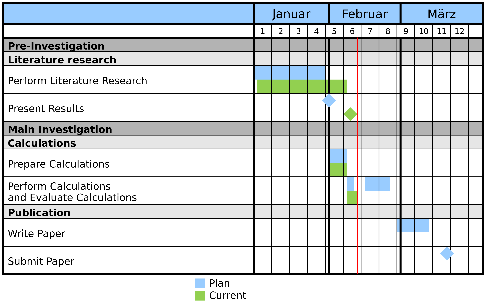

Documentation of pymilestone
============================

Welcome to the documentation of pymilestone.

pymilestone is a Python package, which can be used to create milestoneplans
using the plotting routines of matplotlib. This allows to create high
quality milestoneplans, which can easily be updated.

See the :ref:`tutorial` for examples of milestones and the respective
code blocks to create them.

    
    Example Milestoneplan.

User Guide
###################

.. toctree::
    :maxdepth: 3
    :numbered:
    
    010_introduction.rst
    020_installation.rst
    030_tutorial.rst
    190_contact.rst
    
Programmer Guide
#################

.. toctree::
    :maxdepth: 4
    :numbered:
    
    210_module_description.rst

Indices and tables
##################

* :ref:`genindex`
* :ref:`modindex`
* :ref:`search`
